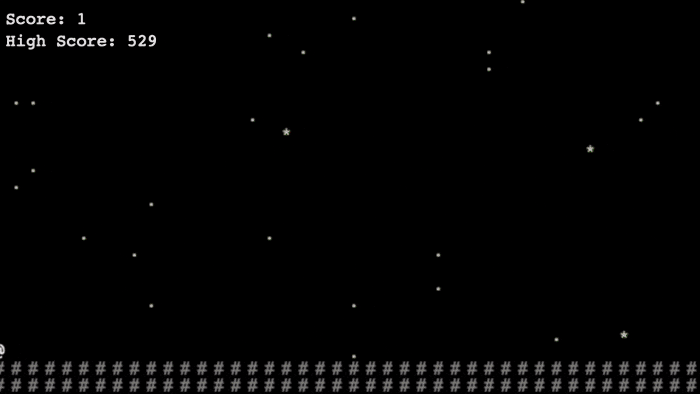

# Tiny Moon Runner
A small (under 5kb unzipped, ~2.5kb zipped) ASCII endless runner, created for the [Apollo 11 GC Game Jam](https://itch.io/jam/agc-jam).

The theme of the game jam was to create a game that took up less than 32 kilobytes of storage, which was the
storage capacity of the Apollo 11 guidance computer.

Rather than trying to do as much as I could with the limitations, I decided to try making as small of a game as I could. I
hadn't made a game in HTML/Javascript before, so I figured it could be a decent challenge.

The visuals in the game are accomplished using a 2D matrix of ASCII characters that are updated on a regular interval to achieve a constant "framerate", with the characters moved between rows and colums of the matrix to simulate motion:
<p align="center">
  
</p>

## Running the Game
To play the game, you can:
- Clone the repo and open index.html in a browser
- Download ```game.zip``` from the repo, unzip it, and then open index.html from the unzipped folder.

## Building
If you want to build the zip for the game yourself, you can follow these steps:
- Install html-minifier
  - ```npm install html-minifier -g```
- Install yuicompressor
  - ```npm install yuicompressor -g```
- Install and link uglifyjs v1
  - [Instructions here](https://github.com/mishoo/UglifyJS2)

Once these packages are installed, run ```./build.sh``` from the top level of the repo.
